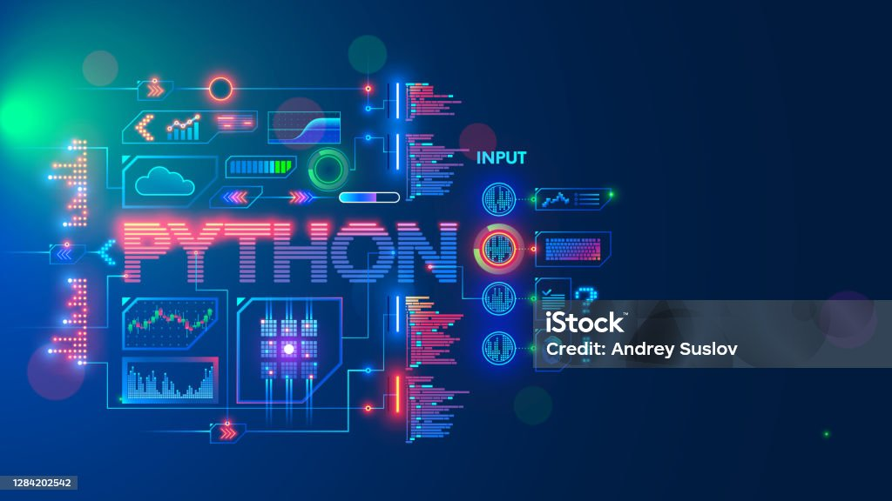

<!-- Tech Background Banner -->

  

<!-- Animated Header Text -->
<h1 align="center">
  
</h1>

<h3 align="center">
  
</h3>

---

## 👩‍💻 About Me

- 🎓 Completed **B.Tech in Computer Science & Engineering** (2021–2025)
- 💡 Passionate about **Web Development**, **Software Engineering**, and **Machine Learning**
- 💼 Exploring full-stack development and real-world AI integration
- 🌱 Learning **Advanced React**, **Node.js**, and **MongoDB**
- ✨ Open to opportunities in **Software Development** and **Internships**

---

## 🛠️ Tech Stack

  

---

## 📫 Connect with Me

  
  
  

---

  

🛠️ Built with ❤️ by <b>Muskan Priya</b>

