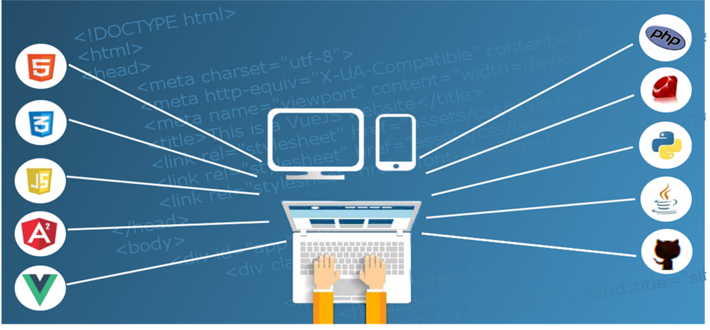

  

<h1 align="center">Hi 👋, I'm Muskan Priya</h1>
<h3 align="center">Software Developer | Full Stack Web Developer | Tech Enthusiast</h3>

  

---

### 👩‍💻 About Me

- 🎓 Completed **B.Tech in Computer Science & Engineering** (2021–2025)
- 💡 Passionate about **Web Development**, **Software Engineering**, and **Machine Learning**
- 💼 Currently exploring full-stack development and real-world AI integration
- 🌱 Learning **Advanced React**, **Node.js**, **Express.js**, and **MongoDB**
- ✨ Open to opportunities in **Software Development**, **Web Development**, and **Internships**

---

### 🛠️ Tech Stack & Tools

---

### 📫 Connect with Me

  
  
  

---

  🛠️ Built with ❤️ by <b>Muskan Priya</b>

